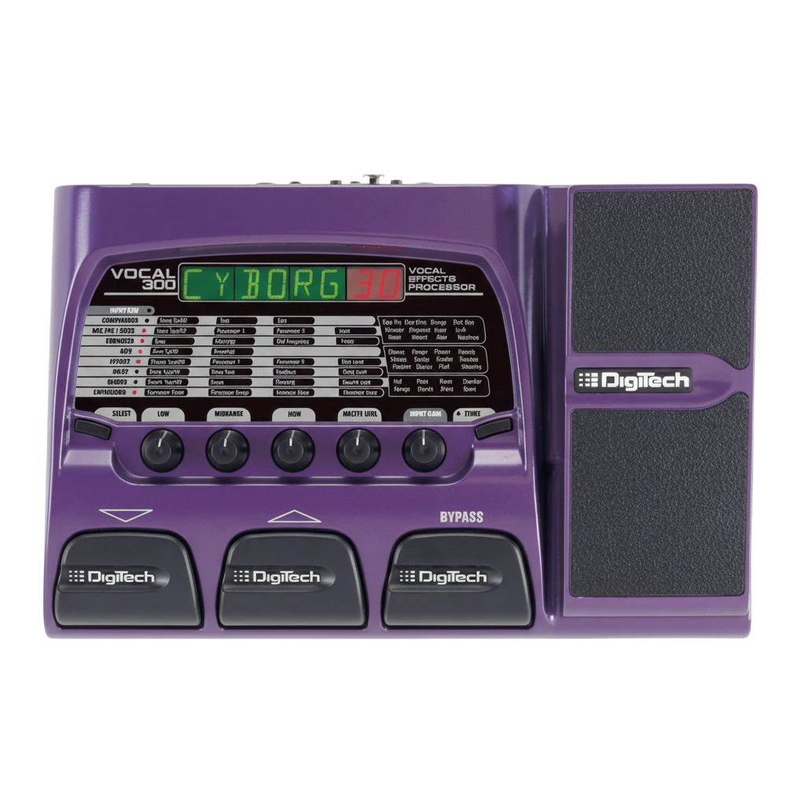

<h1 align="center">
  
  <br>
  PitchShifter
</h1>

<div align="center">

[](https://github.com/elaurentium/pitchshifter/blob/main/LICENSE)
[](https://github.com/elaurentium/pitchshifter/releases)
[](https://github.com/elaurentium/pitchshifter/releases)

</div>

**PitchShifter** is a virtual pedal based on the legendary digitech vocal 300.

## Installation

```bash
# NOT IMPLEMENTED YET
```

## How to contributing
Pull request are ever welcome. For major changes, please open an issue to discuss your proposal and what you'd like to change.

- To keep updated with releases, consider starring the project.
- Check the [contributing guidelines]().

## Overview

The Digitech Vocal 300 is a vocal multi-effects processor in a pedalboard format. It’s designed for performers who want to trigger and control multiple vocal effects live with their feet, keeping their hands free to sing/play. It combines essential vocal pre-processing (gate, compressor, EQ) with creative effects (reverb, delay, modulation, pitch) and includes an expression pedal for real-time parameter control.

Key Features
Multiple vocal effects in a single unit:
Dynamics: noise gate, compressor/limiter.
EQ: shape vocal tone to fit the mix.
Ambience: reverbs (room, plate, hall), delays (short to long, with feedback).
Modulation: chorus, flanger, phaser, tremolo.
Pitch/Voice FX: pitch shift, detune, simple doubling; some patches simulate basic double-tracking.
Presets and user memories:
Factory presets for a range of styles and situations.
User memory slots to save your own patches and effect chains.
Built-in expression pedal:
Continuous control over parameters such as volume, effect mix, delay time, modulation depth, or pitch—per preset assignment.
Performance footswitches:
Fast preset/bank changes with your foot.
Toggle effects on/off as programmed within each patch.
Vocal-focused signal chain:
Typical flow: pre (gate/comp/EQ) → effects (mod/delay/reverb/pitch) → output.
Display and interface:
Screen for preset name/number.
LEDs and dedicated buttons for navigation and basic editing.
Typical Connections
Microphone input (XLR).
Outputs (generally 1/4" L/R to mixer/PA; mono use is fine if needed).
Headphone output (for quick checks/practice).
External power supply connector (use the specified adapter only).
Important note: many units do not provide phantom power on the XLR input. If you use a condenser mic, check your Vocal 300’s manual and/or provide phantom power from a mixer/interface. Dynamic mics (e.g., SM58) can typically connect directly.

Practical Use Cases
Lead vocal live:
Light compression, gentle EQ, short delay with low repeats, and a moderate plate reverb.
Ballad/ambient:
Longer hall reverb + tempo-synced delay to the song’s BPM.
Creative effect:
Subtle chorus to “open up” the vocal in choruses; control the mix via the expression pedal.
Simple doubling:
Slight detune (±5–10 cents) to make the voice sound fuller.
Setup Tips
Input gain: set for a healthy signal without clipping. Use level indicators if available.
Compressor: start light to preserve natural dynamics.
EQ: use a low cut if things sound muddy; lift upper mids sparingly to avoid sibilance.
Delay: less is more live; keep feedback low and mix moderate for intelligibility.
Reverb: match the venue. In highly reflective rooms, reduce pedal reverb.
Expression pedal: map it to something musically useful (e.g., delay mix to highlight phrase endings).
Presets: keep a “Clean” (almost dry) and a “Lead” (for choruses/solos) for quick switching.
Live Best Practices
Feed the Vocal 300 into a dedicated mixer channel with proper gain and EQ.
Do a line check and level set before the show.
Keep a fallback preset (Clean + light reverb) in case other patches feel too wet in the PA.
If using in-ear monitors, test latency and effect amounts so they don’t hinder performance.
Limitations and Notes
“Intelligent” harmonization (key/scale-aware) is limited or absent on many patches; expect basic pitch shift/detune rather than a full harmonizer.
Phantom power is typically not available; verify for your unit.
As an older device, ensure correct power supply and cabling; only use the recommended power specs.
Care and Maintenance
Use the official power supply or an exact-spec equivalent.
Balanced cabling where applicable helps reduce noise.
Keep the unit clean and dry; avoid liquids and drops.
Document your presets (names/settings) so you can quickly recreate them if needed.


## License
This software is licensed under the [MIT](LICENSE) © [Evandro L. Limeira](https://github.com/elaurentium)
